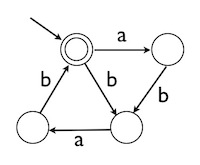
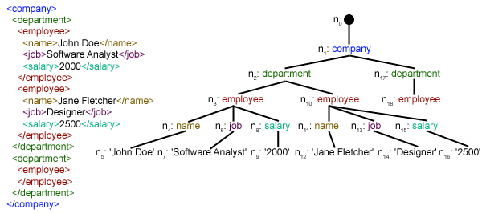
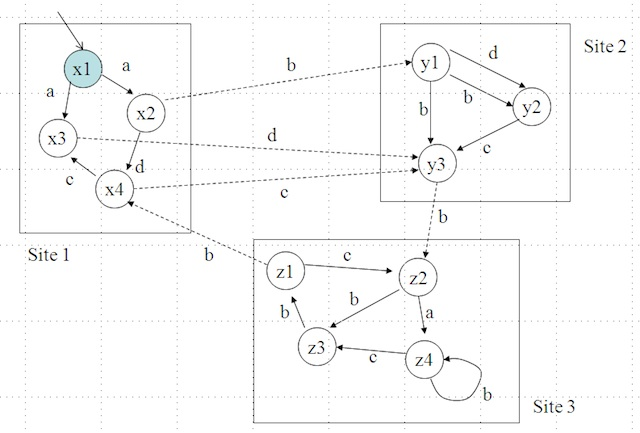

# COMP9319 Exercises 07

## Question 1

1. Using the linear-time SA construction algorithm discussed in the class, derive the Burrows Wheeler transform BWT(S) of character sequence S:
2. **database$**

3. Derive the Move-to-Front transform of the BWT(S) from part (a), assuming we use the 255 ASCII symbols as the symbol table.
4. 

5. Derive and recover the original character sequence S for the BWT(S):
6. **arbbr$aa**

7. where $ is the pseudo end of sequence symbol.

## Question 2

1. Derive a regular expression equivalent to the DFA:

2. Draw a DFA equivalent to the regular expression

    

   a*b(a|b)*

   

## Question 3

Will these two XPath expressions /bib//book[year > 2000]/author and /bib[*//year > 2000]//book/author always produce the same result on any XML documents? If not, will one of them always produce a subset of the result from the other one. Explain your answer.

## Question 4

Using the following example XML fragment and its corresponding XML tree, explain how ISX scheme can achieve efficient and yet queriable XML compression:

A Dataguide is a simple index for semistructured data. Draw the Dataguide for the XML tree above.

## Question 5

Using the example XML fragment from Question 4, explain how XBW transform works. In particular, explain how to match a sub-path in an XML tree efficient using XBW transform.

## Question 6

Using the regular path expression **a.b+.c** and the following distributed database as an example, describe how queries on distributed semistructured data can be evaluated efficiently (with the cost of network communications minimised). Please show intermediate steps/results.

