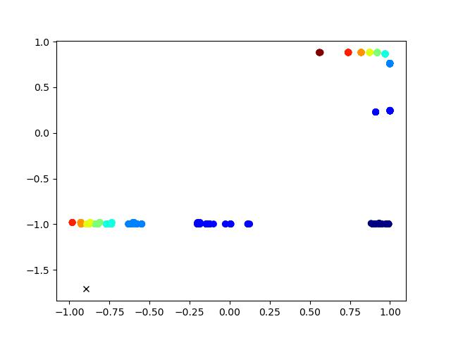

### Part 1: Japanese Character Recognition


1. **[1 mark] Implement a model `NetLin` which computes a linear function of the pixels in the image, followed by log softmax. **

   ```
   [[770.   5.   7.  13.  30.  61.   2.  62.  30.  20.]
    [  7. 670. 110.  19.  26.  21.  59.  12.  24.  52.]
    [  9.  61. 693.  26.  27.  22.  46.  34.  45.  37.]
    [  4.  39.  59. 756.  16.  57.  13.  18.  27.  11.]
    [ 61.  53.  82.  21. 621.  20.  31.  34.  21.  56.]
    [  8.  28. 125.  16.  19. 724.  28.   8.  33.  11.]
    [  5.  22. 152.   9.  27.  25. 716.  20.   9.  15.]
    [ 18.  30.  25.  11.  84.  15.  53. 628.  88.  48.]
    [ 10.  38.  95.  42.   8.  32.  43.   7. 703.  22.]
    [  8.  51.  88.   3.  55.  31.  20.  30.  39. 675.]]
   
   Test set: Average loss: 1.0082, Accuracy: 6956/10000 (70%)
   ```

   

2. **[1 mark] Implement a fully connected 2-layer network `NetFull` (i.e. one hidden layer, plus the output layer), using tanh at the hidden nodes and log softmax at the output node.**

   ```
   [[853.   2.   1.   7.  26.  30.   3.  39.  31.   8.]
    [  7. 812.  38.   4.  17.   7.  67.   5.  17.  26.]
    [  9.  14. 840.  40.  14.  14.  25.   9.  15.  20.]
    [  3.  11.  29. 918.   2.  15.   6.   4.   4.   8.]
    [ 37.  24.  19.   9. 829.   8.  31.  14.  15.  14.]
    [ 10.  13.  85.  10.  12. 829.  21.   3.   9.   8.]
    [  3.  13.  65.   8.  15.   4. 877.   6.   2.   7.]
    [ 16.  15.  24.   6.  23.   9.  23. 830.  22.  32.]
    [ 13.  33.  28.  42.   2.   6.  26.   6. 836.   8.]
    [  3.  14.  48.   4.  27.   5.  25.  16.  15. 843.]]
   
   Test set: Average loss: 0.5075, Accuracy: 8467/10000 (85%)
   ```

   **Calculation of the total number of independent parameters in the network:**

   - Hidden Layer (Input Channel: $28 \times 28$, Output Channel: $160$)

     $\text{weights} = (28 \times 28) \times 160 $

     $\text{biases} = 160$

     $\text{Total} = (28 \times 28) \times 160 + 160 = 125600$

   - Hidden Layer (Input Channel: $160$, Output Channel: $10$)

     $\text{weights} = 160 \times 10 $

     $\text{biases} = 10$

     $\text{Total} = 160 \times 10 + 10 = 1610$

   $$
   \text{Total} = 125600 + 1610 =127210
   $$

   

3. **[2 marks] Implement a convolutional network called `NetConv`, with two convolutional layers plus one fully connected layer, all using relu activation function, followed by the output layer, using log softmax. You are free to choose for yourself the number and size of the filters, metaparameter values (learning rate and momentum), and whether to use max pooling or a fully convolutional architecture.**

   *Set momentum to 0.9 `python3 kuzu_main.py --net conv --mom 0.9` and use $2 \times 2$ Pooling Layer.*

   ```
   [[956.   2.   4.   1.  13.   5.   0.  15.   3.   1.]
    [  3. 950.   6.   1.   4.   1.  22.   2.   2.   9.]
    [  8.   7. 860.  45.   7.  15.  34.  15.   3.   6.]
    [  2.   1.  22. 956.   1.   6.   3.   3.   1.   5.]
    [ 17.   6.   9.   9. 923.   1.   9.  10.   9.   7.]
    [  4.  12.  27.   5.   5. 920.  19.   1.   2.   5.]
    [  1.  11.  10.   1.   3.   1. 965.   5.   1.   2.]
    [ 14.   2.   1.   2.   3.   0.   7. 954.   5.  12.]
    [  3.  17.   2.   2.   8.   4.   8.   1. 953.   2.]
    [  7.   6.   3.   3.   8.   1.   0.   2.   3. 967.]]
   
   Test set: Average loss: 0.3108, Accuracy: 9404/10000 (94%)
   ```

   Calculation of the total number of independent parameters in the network:

   - Conv1 (Input Channel: $1$, Output Channel: $64$, Kernel Size: $3\times 3$)

     $\text{weights} = 1 \times 64 \times 3 \times 3$

     $\text{biases} = 64$

     $\text{Total} = 1 \times 64 \times 3 \times 3 + 64 = 640$

   - Conv2 (Input Channel: $64$, Output Channel: $128$, Kernel Size: $3\times 3$)

     $\text{weights} = 64 \times 128 \times 3 \times 3$

     $\text{biases} = 128$

     $\text{Total} = 64 \times 128 \times 3 \times 3 + 128 = 73856$

   - FC (Input Channel: $128 \times 7 \times 7$, Output Channel: $10$)

     $\text{weights} = 128 \times 7 \times 7 \times 10 $

     $\text{biases} = 10$

     $\text{Total} = 64 \times 128 \times 3 \times 3 + 128 = 62730$

   $$
   \text{Total} = 640 + 73856 + 62730 = 137226
   $$


4. **[4 marks] Briefly discuss the following points.**

   1. **the relative accuracy of the three models**

      - For the `NetLin` model, since it is a purely linear model, it can only learn linear relationships and cannot capture non-linear patterns in the data, and it also lacks complexity, with an accuracy of only $69.56\%$. This indicates that it is difficult to fully utilize the information in the data in image classification tasks using only linear models.

      - For the `NetFull` model, which contains a hidden layer and an output layer, by increasing the number of hidden nodes, the model can learn the nonlinear relationships in the data. This results in a $14\%$ improvement in accuracy over a purely linear model.

      - For the `NetConv` model, which contains two convolutional layers, two pooling layers and a fully connected layer, the extraction of local features and spatial information can be stronger, while the momentum is improved from $0.5$ to $0.9$, which accelerates the accelerated convergence of the model. Compared to the first two, the accuracy rose to $94\%$. The local features and spatial information captured by the convolutional layer greatly improves the classification ability of the model, which is very suitable for processing image data.

        

   2. **the number of independent parameters in each of the three models**

      The `NetLin` model has $7850$ parameters, the `NetFull` model has $127210$ parameters, and the `NetConv` model has $137226$ parameters. As the number of parameters increases, the performance of the model improves further.

      But it is not the case that more parameters means better modeling. When I test the first layer of convolutional layer output $16$ channels, the second layer output $32$ channels, his parameter number is only $20490$, but the final result is close to $91\%$, better than $160$ nodes of the hidden layer. So the classification effect is still strongly related to the model.

      

   3. **the confusion matrix for each model: which characters are most likely to be mistaken for which other characters, and why?**

      - For the `NetLin` model, the top three most misrecognized characters after the confusion matrix are: $4(379) > 7(372) > 1(330)$

      - For the `NetFull` model, the top three most misrecognized characters after the confusion matrix are: $1(188) > 4(171) = 5(171)$

      - For the `NetConv` model, the top three most misrecognized characters after the confusion matrix are: $2(140) > 5(80) > 4(77)$

      Comparatively, Category $4$, also known as "na", seems to be the most erroneous, with Category $4$ being statistically misidentified as Category $0$ ranking second in the `NetLin` model ($61$) and first in the other two clocks (`NetFull`: $37$, `NetConv`: $17$). 

      By looking specifically at the way this word is written, it was observed that both Category $4$ ("na **な**") and Category $0$ ("o ") have a similar curved structure in the lower part. This similarity caused the model to show a high error rate in distinguishing these two categories.


### Part 2: Multi-Layer Perceptron


1. **[1 mark] Train a 2-layer neural network with either 5 or 6 hidden nodes, using sigmoid activation at both the hidden and output layer.**

   - hid_6_0

   - hid_6_1

   - hid_6_2

   - hid_6_3

   - hid_6_4

   - hid_6_5

   - out_6

   

2. **[2 marks] Design by hand a 2-layer neural network with 4 hidden nodes, using the Heaviside (step) activation function at both the hidden and output layer, which correctly classifies the above data. Include a diagram of the network in your report, clearly showing the value of all the weights and biases. Write the equations for the dividing line determined by each hidden node. Create a table showing the activations of all the hidden nodes and the output node, for each of the 9 training items, and include it in your report.**

   - Diagram of the network 

     

   

   

   

   - Equations for the dividing line determined by each hidden node

   $$
   \begin{align*}
   H_1 &= \text{Heaviside}(2 \cdot x_1 + 2 \cdot x_2 + 1) \\
   H_2 &= \text{Heaviside}(-2 \cdot x_1 + 2 \cdot x_2 + 1) \\
   H_3 &= \text{Heaviside}(2 \cdot x_1 - 2 \cdot x_2 + 1) \\
   H_4 &= \text{Heaviside}(-2 \cdot x_1 - 2 \cdot x_2 + 1) \\
   \text{Total} &= \text{Heaviside}(H_1 + H_2+ H_3+ H_4 - 3) \\
   \end{align*}
   $$

   

   - Table showing the activations of all the hidden nodes and the output node

   | $x_1$ | $x_2$ |  $T$  | $H_1$ | $H_2$ | $H_3$ | $H4$ | Output |
   | ----- | ----- | ----- | ----- | ----- | ----- | ---- | ------ |
   | $-1$  | $-1$  | $1$   | $0$   | $1$   | $1$   | $1$  | $1$    |
   | $-1$  | $0$   | $0$   | $0$   | $1$   | $0$   | $1$  | $0$    |
   | $-1$  | $1$   | $1$   | $1$   | $1$   | $0$   | $1$  | $1$    |
   | $0$   | $-1$  | $0$   | $0$   | $0$   | $1$   | $1$  | $0$    |
   | $0$   | $0$   | $1$   | $1$   | $1$   | $1$   | $1$  | $1$    |
   | $0$   | $1$   | $0$   | $1$   | $1$   | $0$   | $0$  | $0$    |
   | $1$   | $-1$  | $1$   | $1$   | $0$   | $1$   | $1$  | $1$    |
   | $1$   | $0$   | $0$   | $1$   | $0$   | $1$   | $0$  | $0$    |
   | $1$   | $1$   | $1$   | $1$   | $1$   | $1$   | $0$  | $1$    |


3. **[1 mark] Now rescale your hand-crafted weights and biases from Part 2 by multiplying all of them by a large (fixed) number (for example, 10) so that the combination of rescaling followed by sigmoid will mimic the effect of the step function. With these re-scaled weights and biases, the data should be correctly classified by the sigmoid network as well as the step function network.**
- hid_4_0
   
- hid_4_1
   
- hid_4_2
   
- hid_4_3
   
- out_4


### Part 3: Hidden Unit Dynamics for Recurrent Networks

1. **[2 marks] Train a Simple Recurrent Network (SRN) on the Reber Grammar prediction task.**

   

   

   

   

   

    

    

   

    

   

    

   

    

   

   

2. **[1 mark] Train an SRN on the $a^nb^n$ language prediction task.**

   

   In the $a^n b^n$ prediction task, it can be seen from the figure that as characters are input, the activation state of the hidden units gradually changes to form clusters of dots of different colors. The initial state is represented by the red cluster and as 'a' is input, the activation state of the network changes gradually along the red, yellow and green clusters, which indicates how many 'a's have been input. When the network receives the first 'b', the activation state shifts to the blue cluster, which means that the model starts processing 'b'.

   With each 'b' input, the activation state continues to change within the blue cluster, gradually decreasing the number of previously remembered 'a' and current 'b' until 'a' and 'b' match exactly. In this process, the activation state is shifted from the red cluster to the blue cluster, indicating a shift from remembering the state of 'a' to matching the state of 'b'.

   Finally, when all 'b' have been processed, the activation state of the network returns to the red cluster, ready to process the next sequence of 'a'.

   

   

   

   

   

   

   

3. **[2 marks] Train an SRN on the *anbncn* language prediction task.**

   

   

   

   

   

   When the network starts processing the input sequence, the initial state is represented by the red cluster. As 'a' is input, the activation state gradually changes along clusters of red, orange, yellow, and green dots. These changes indicate that the network is gradually remembering how many 'a's have been entered. Each time an 'a' is entered, the activation state of the hidden unit moves to the next cluster of dots, showing that the network is remembering and keeping track of the number of 'a'.

   After all 'a' are entered, the network starts processing 'b'. The green and light blue clusters may indicate the state of the network when it starts processing 'b'. Each time a 'b' is entered, the activation state of the hidden unit continues to change, showing how the network remembers and keeps track of the number of 'b'. As more 'b's are entered, the activation state moves along the cluster of green and light blue dots, and the network is matching the 'a's and 'b's to make sure they are equal in number.

   After processing all the 'b's, the network moves on to process 'c'. The blue and dark blue clusters in the figure indicate the state of the network when it starts processing 'c'. With each 'c' input, the activation state changes further, showing that the network remembers and keeps track of the number of 'c'. As more 'c's are entered, the activation state moves along the blue and dark blue dot clusters, and the network matches 'a', 'b' and 'c ' for matching, ensuring that the three are equal in number.

   

   

   

   

   

   

4. **[3 marks] Train an LSTM network to predict the Embedded Reber Grammar.**

   LSTM behaviour

   - Ignoring the setting of the values in the first half of the forward above, starting with `gates = x_t @ self.W + h_t @ self.U + self.hid_bias` is the beginning of the main logic of the LSTM.

   - This step produces the gating value by multiplying the current input with the previous hidden state, plus the bias.

   - Then an input gate `i_t`, an oblivion gate `f_t`, both compressed to [0, 1] by applying a sigmoid function, are defined.

   - Then a candidate memory value `g_t` and a memory cell `c_t` are set. The forgetting gate determines the percentage of previous memories to be retained, and the input gate determines the percentage of input information to be written.

   - The output gate o_t is then set to control the effect of the memory cell on the hidden state as well as determining how much information from the memory cell is passed on to the hidden state h_t.

    LSTM accomplished the task

   - These gates are used to capture the input sequence structure. Input gates and forgetting gates determine which information is retained or forgotten based on the input and the previous hidden state.

   - Memory cells and candidate memory values control the generation of new memory states.

   - The outputs determine the output of the updated hidden state.

    Train

   In testing, an increase in hidden nodes reduces the error rate, but can lead to overfitting. A relative setting of 9 already achieves an error rate of 0.0005.


